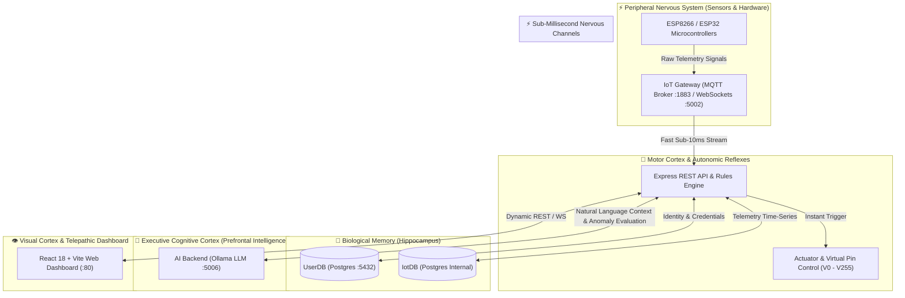

# ⚡ நுண்ணறி (Nunnarri): Smart Intelligence IoT Platform

[](LICENSE)
[](docker-compose.yml)
[](https://nodejs.org)
[](https://www.postgresql.org)
[](https://react.dev)
[](https://mqtt.org)
[](https://ollama.ai)

---

<p align="center">
  
</p>

<div align="center">

### **நுண்ணறி • Nunnarri**
#### **இணைப்பு • அறிவு • கட்டுப்பாடு** *(Connectivity • Intelligence • Control)*
#### **Smart Intelligence Cyber-Physical Platform & AI Core**

</div>

> **நுண்ணறி (Nunnarri)** is an open-source, full-stack, enterprise-grade **Smart Intelligence IoT Management & Local AI Platform**. The name **நுண்ணறி** (*Nunnarri*) signifies **Smart Intelligence** — bridging raw physical hardware telemetry (ESP8266/ESP32), sub-millisecond MQTT communication, dual-database memory architectures, and localized Large Language Models (LLMs) into a unified, autonomous cyber-physical operating system.

---

## 🎨 Dashboard & Graphical User Interface


```
┌─────────────────────────────────────────────────────────────────────────────────────────────┐
│ 🧠 NUNNARRI CONTROL CENTER HUD                                   [ 14 Active ]  [ OPTIMAL ] │
├──────────────────────────────┬────────────────────────────────────────┬─────────────────────┤
│ 🤖 LOCAL AI CORTEX (Ollama)  │ 📊 TELEMETRY GAUGES & REAL-TIME LOGS   │ 🎛️ VIRTUAL PIN HUD  │
│                              │                                        │                     │
│  User: "Optimize HVAC and    │   [ TEMP ]     [ HUMIDITY ]    [ AQI ] │  (V1) RELAY SWITCH  │
│  check room temperature."    │     68°F          42%           32     │  [ ON ] ──────────  │
│                              │    (  O  )       (  O  )      ( O )    │                     │
│  Cortex: "Adjusting Virtual  │                                        │  (V2) SMART LIGHTS  │
│  Pin V3. Room temperature is │ 📈 LIVE SENSOR STREAM (Time-Series)    │  [ AUTO ] ────────  │
│  optimal at 68°F."           │  50|      /\       /\                 │                     │
│                              │  25| ____/  \_____/  \______          │  (V3) PUMP MOTOR    │
│  [Neural Node Visualizer]    │   0+───10:00───10:30───11:00───>       │  [ OFF ] ─────────  │
└──────────────────────────────┴────────────────────────────────────────┴─────────────────────┘
```

---

## 🌌 Why Build the Future with IoT & AI? The Vision Behind Nunnarri (நுண்ணறி)

> [!IMPORTANT]
> **The Next Tech Frontier**: We are transitioning from the era of static software to the era of **Autonomous Cyber-Physical Intelligence**. Standalone hardware is blind without software, and software is disconnected without physical sensors. **Nunnarri (Smart Intelligence) unites physical sensors with artificial cognitive reasoning.**

### 1. The Death of Dumb Hardware
Traditional IoT platforms act as passive loggers—collecting data and relying on human operators to manually configure rules. **Nunnarri embeds local AI intelligence (Ollama LLM + Anomaly Engines)** directly into the loop, allowing systems to predict failures, adjust environment dynamics, and execute autonomous corrective actions.

### 2. Open-Source Data Sovereignty
Proprietary cloud platforms lock your hardware into cloud subscriptions, data harvesting, and vendor deprecations. Nunnarri provides **100% data sovereignty**: your telemetry, user databases, and AI models run locally on your own hardware using Docker.

---

## 🧠 Deep-Dive Architectural Analogy: Elon Musk’s Neural Architecture vs. Nunnarri

Elon Musk’s vision (Neuralink & Tesla FSD) focuses on high-bandwidth bio-digital interfaces—merging biological neural networks with synthetic AI processors. **Nunnarri brings this exact neural architecture to the physical world of IoT.**



### Detailed Structural Comparison Table

| Neural Component (Biological / Neuralink) | Nunnarri Platform Component | Detailed Functional Metaphor |
| :--- | :--- | :--- |
| **Prefrontal Cognitive Cortex** | `ai-backend` (Ollama LLM + Anomaly Detection) | **Executive Reasoning**: Processes natural language queries ("Why is energy consumption high?"), analyzes telemetry anomalies, and plans actions. |
| **Central Nervous System & Spinal Cord** | `iot-gateway` (MQTT 1883 + WebSockets 5002) | **High-Bandwidth Pulse Channel**: Transmits sub-millisecond nerve impulses bi-directionally between sensors and the central processing core. |
| **Motor Cortex & Autonomic Reflexes** | `backend` & `AiAutomationEngine` | **Involuntary Reflexes**: Executes instant safety triggers (e.g., automatically cutting off a gas relay when threshold is breached) without waiting for human input. |
| **Hippocampus & Synaptic Memory** | Dual PostgreSQL (`user-db` + `iot-db`) | **Long-Term Memory Storage**: `user-db` handles identity/synaptic authorization, while `iot-db` acts as time-series memory of past physical events. |
| **Visual Cortex & Telepathic HUD** | `frontend` (React + Vite + Nginx) | **Sensory Visualization**: Renders complex environmental states into dynamic, human-understandable visual dashboards, gauges, and live logs. |
| **Peripheral Nerves & Sensory Receptors** | Hardware Nodes (ESP8266 / ESP32 / Sensors) | **Physical Tactile Nodes**: Reads temperature, humidity, vibration, and air quality from the physical environment and fires physical GPIO outputs. |

---

## 🌟 Key Platform Features

- ⚡ **Sub-Millisecond Telemetry Ingestion**: Embedded MQTT broker (`1883`) and WebSocket gateway (`5002`) for real-time telemetry streaming.
- 📌 **Blynk-Style Virtual Pin Architecture**: Bind hardware inputs/outputs (`V0` to `V255`) to interactive UI widgets seamlessly.
- 🤖 **On-Premise Sovereign AI**: Integrated localized LLM (`Ollama` + `tinyllama`) for natural language commands and anomaly detection.
- 🎨 **Dynamic Glassmorphism Dashboard**: Customizer pages (Nunnarri & Blynk customizers), Virtual Pin Manager, MQTT Live Monitor, and Admin Panel.
- 🛡️ **Clean Microservices Security**: JWT authentication, RBAC admin privileges, dynamic device API key validation.
- 🐳 **One-Command Docker Deployment**: Ready-to-go multi-container environment with automated health checks.

---

## 🚀 Quick Start (Docker Orchestration)

### Prerequisites
- [Docker Desktop](https://www.docker.com/) or Docker Engine (`>= 20.10`)
- Docker Compose (`v2.x`)

### Deployment Commands

1. **Clone the repository**:
   ```bash
   git clone https://github.com/your-username/nunnarri-iot-ai.git
   cd nunnarri-iot-ai
   ```

2. **Launch all 6 microservices**:
   ```bash
   sudo docker compose up -d --build
   ```

3. **Check container status**:
   ```bash
   sudo docker compose ps
   ```

4. **Access Applications**:
   - 🌐 **Web Dashboard**: `http://localhost`
   - 🔌 **Backend REST API**: `http://localhost:5000`
   - 🤖 **AI Intelligence API**: `http://localhost:5006`
   - ⚡ **IoT WebSocket Gateway**: `ws://localhost:5002`
   - 📡 **MQTT Broker**: `mqtt://localhost:1883`

---

## 🔌 Microcontroller Hardware Connection (ESP8266 / ESP32)

Upload [`esp8266_test_sketch.ino`](file:///home/harshar/Downloads/full-main/esp8266_test_sketch.ino) to your board using the Arduino IDE:

```cpp
// ESP8266 Firmware Configuration
const char* ssid         = "YOUR_WIFI_SSID";
const char* password     = "YOUR_WIFI_PASSWORD";
const char* mqtt_server  = "YOUR_DOCKER_HOST_IP"; 
const int   mqtt_port    = 1883;
const char* device_token = "NUNNARRI_DEVICE_API_KEY";

// Telemetry Topic: nunnarri/devices/{device_id}/telemetry
// JSON Payload: {"vPin": "V1", "value": 24.5}
```

---

## 🛠️ Troubleshooting & Common Docker Solutions

> [!TIP]
> **Issue 1: `Bind for 0.0.0.0:5432 failed: port is already allocated`**
> - **Solution**: Stop local host PostgreSQL daemon: `sudo systemctl stop postgresql` then run `sudo docker compose up -d`.

> [!NOTE]
> **Issue 2: `getaddrinfo EAI_AGAIN user-db`**
> - **Solution**: Docker DNS startup timing window. Restart the backend container: `sudo docker compose restart backend`.

---

## 🤝 Open Source License & Vision

This project is **100% Open Source** under the [MIT License](LICENSE). 

Building the future means giving every engineer, maker, and enterprise access to autonomous cyber-physical intelligence without artificial paywalls.

- **Fork & Star** the repository to support open-source IoT + AI!
- Pull requests and contributions are welcome.

---

<p align="center"><b>Built with ❤️ for the Global Open Source Cyber-Physical & AI Community</b></p>
